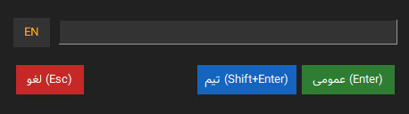
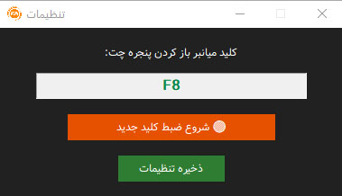

# 🇮🇷 فارسی‌نویس هوشمند برای ClientMod

  

**دیگر نگران تایپ فارسی در بازی Counter-Strike: Source نباشید!**

ابزار سبک، سریع و هوشمند **FarsiNevisCM** امکان چت کاملاً راحت به زبان فارسی را در بازی کانتر کلاینت‌مود فراهم کرده است.

---

## 🚀 دریافت و نصب

1. به بخش **[Releases](https://github.com/PeymanFZN/FarsiNevisCM/releases/tag/v1.0.0)** بروید.
2. آخرین نسخهٔ `FarsiNevisCM.exe` را دانلود کنید.
3. فایل را اجرا کنید (آیکون برنامه در **System Tray** ویندوز ظاهر می‌شود).
4. با زدن کلید میانبر پیش‌فرض **`F8`** میتوانید پنجره فارسی‌نویس را میتوانید باز کنید. 

---

## ⚙️ تنظیمات ضروری  

### ۱. تنظیم Launch Prams (در لانچر ClientMod) 
برای اینکه پنجره چت روی بازی اجرا شود قبل از اجرای کامل بازی کد زیر را در تنظیمات لانچر کلاینت‌مود بخش **`Launch Prams`** وارد کنید: 
 
 **`-windowed -noborder`** 
### 2. جلوگیری از قطع شدن صدای بازی
کنسول بازی را با کلید **`~`** باز کنید و دستور زیر را وارد کنید تا موقعی که پنجره چت فارسی نویس رو باز میکنید صدای بازی قطع نشه:

 **`snd_mute_losefocus 0`** 

---

## 📝 نحوه استفاده

1. با کلید میانبر پیشفرض **`F8`** پنجره برنامه را باز کنید. 
2. متن فارسی خود را تایپ کنید.
3. متن را ارسال کنید:

   - **`Enter`** → ارسال به **چت عمومی (All Chat)**
   - **`Shift + Enter`** → ارسال به **چت تیمی (Team Chat)**

> برنامه به‌صورت خودکار متن را کپی می‌کند و کلید `Y` یا `U` را می‌زند و پیام را Paste و ارسال می‌کند. 

---

## 🎮 تغییر کلید میانبر 
برای اینکه کلید میانبر پیشفرض **`F8`** را تغییر دهید میتوانید بعد از اجرای برنامه روی آیکون برنامه در **System Tray** کلیک راست و گزینه تنظیمات را انتخاب کنید سپس با کلیک بر روی دکمه **شروع ضبط کلید جدید 🔴** کلید میانبر خود را تغییر دهید و تنظیمات را ذخیره کنید. 

---

## ☕ حمایت از پروژه

اگر این ابزار برای شما مفید بوده، با حمایت مالی کوچک می‌توانید به ادامه توسعه و به‌روزرسانی آن کمک کنید:

**[❤️ حمایت از توسعه‌دهنده (دارمت)](https://daramet.com/PeymanFZN)**

---

## 📸 پیش‌نمایش

| پنجره اصلی برنامه          | چت فارسی داخل بازی          |
|:---------------------------:|:---------------------------:|
|  |  |

---

## ⭐ ستاره بدهید!

اگر برنامه به دردتون خورد، لطفاً به ریپازیتوری **ستاره** ⭐ بدهید تا افراد بیشتری بتوانند آن را پیدا کنند. 
---

**تهیه شده با ❤️ برای جامعه ایرانی Counter-Strike**

